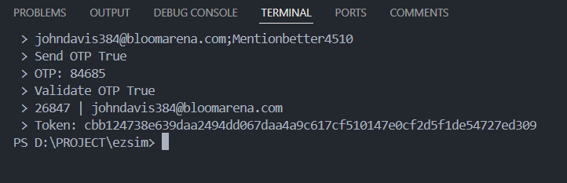

# 🕵️‍♂️ ezsim.com-acc create

## Preview

## 🚀 How to use

Termux - Android (recommended version 0.117 - last)

[TERMUX](https://www.apkmirror.com/apk/fredrik-fornwall/termux-fdroid-version/termux-fdroid-version-0-119-0-beta-1-release/termux-f-droid-version-0-119-0-beta-1-android-apk-download/)

1. pkg upgrade && update
2. pkg install git
3. pkg install python
4. pkg install python-pip
5. termux-setup-storage
6. cd /storage/emulated/0
7. git clone https://github.com/mza-xxdv/ezsim-create.git
8. cd ezsim-create
9. ls
10. pip install -r requirements.txt
11. python main.py

## Author
@mza-xxdv
